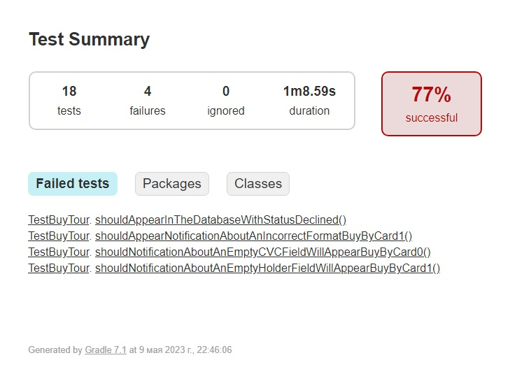
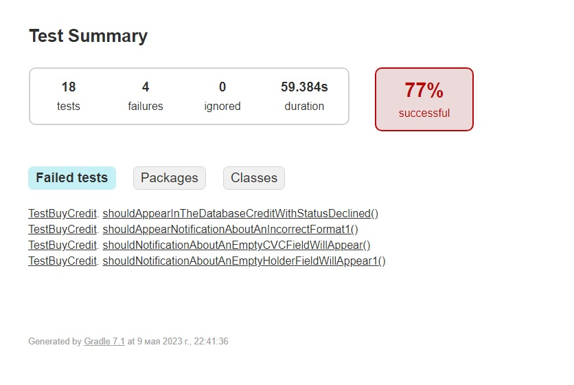

## Краткое описание
* Успешно прошли 78% тестов 22% провалились.
* Было запущено 36 авто-тестов, благодаря им обнаружено 8 дефектов. 
* Три из них имеют критический уровень и распространяются на обе формы. 
#### Критические дефекты описаны в issues

### Общие рекомендации
1. В первую очередь исправить все критические ошибки.
2. Добавить селекторы для тестирования. Чтобы упростить поиск локаторов.
3. У большинства полей отсутствует правильное описание уведомлений о пустых полях. 

### Скриншоты отчетов дебетовой с кредитной формы покупки тура:

