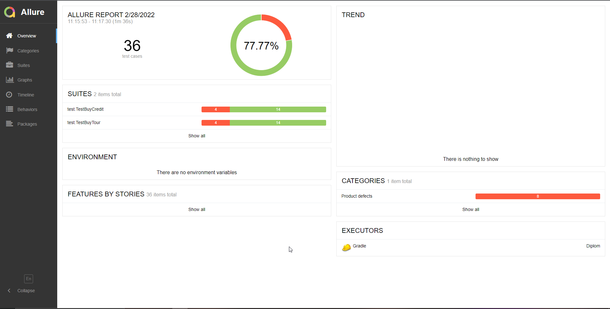

## Краткое описание
* Успешно прошли 78% тестов 22% провалились.
* Было запущено 36 авто-тестов, благодаря им обнаружено 8 дефектов. 
* Три из них имеют критическую серьезность и распространяются на обе формы. 
#### Ссылки на критические дефекты:
1. [Неправильная валидация у поля имя](https://github.com/IqaEnganer/CoursePaper/issues/4)
2. [Поле месяц принимает значение "00"](https://github.com/IqaEnganer/CoursePaper/issues/5)
3. [На сайте отображается успешность покупки вместо отказа](https://github.com/IqaEnganer/CoursePaper/issues/1)
### Общие рекомендации
1. В первую очередь исправить все критические ошибки.
2. Добавить селекторы для тестирования. Чтобы упростить поиск локаторов.
3. У большинства полей отсутствует правильное описание уведомлений о пустых полях. 
Дефект не завел, так-как интуитивно понятно.
Но рекомендую сделать более понятные описания ошибок валидации полей.

### Скриншот сгенерированного отчета.
